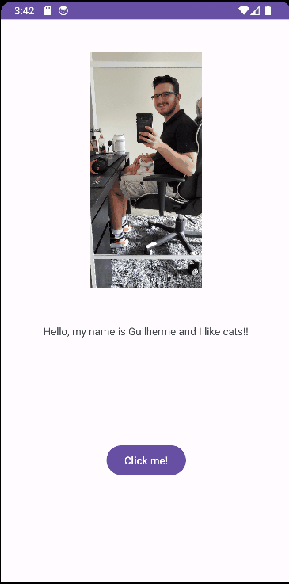

# Android Prework - *World2*

Submitted by: **Guilherme Vilatoro Taglianeti**

**World2** is an android app that shows an image and introductory message, and allows pressing a button to display a Toast. 

Time spent: **1** hours spent in total

## Required Features

The following **required** functionality is completed:

* [x] Image and introductory message displayed on screen
* [x] Button displayed on screen
* [x] Toast with message appears when button is pressed 

The following **optional** features are implemented:

* [ ] List anything else that you can get done to improve the app functionality!
  Add more butoons with different effects.

## Video Walkthrough

Here's a walkthrough of implemented features:

<!-- Replace this with whatever GIF tool you used! -->
GIF created with ...
[ScreenToGif](https://www.screentogif.com/) for Windows

## Notes

Describe any challenges encountered while building the app.
